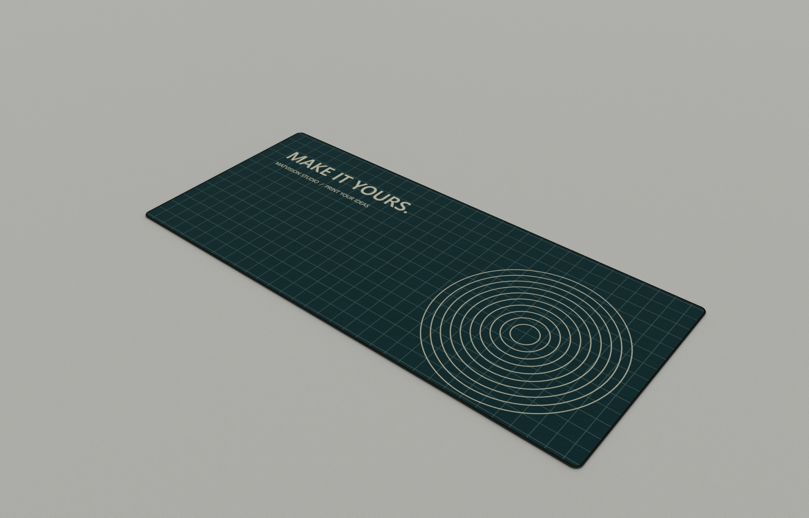
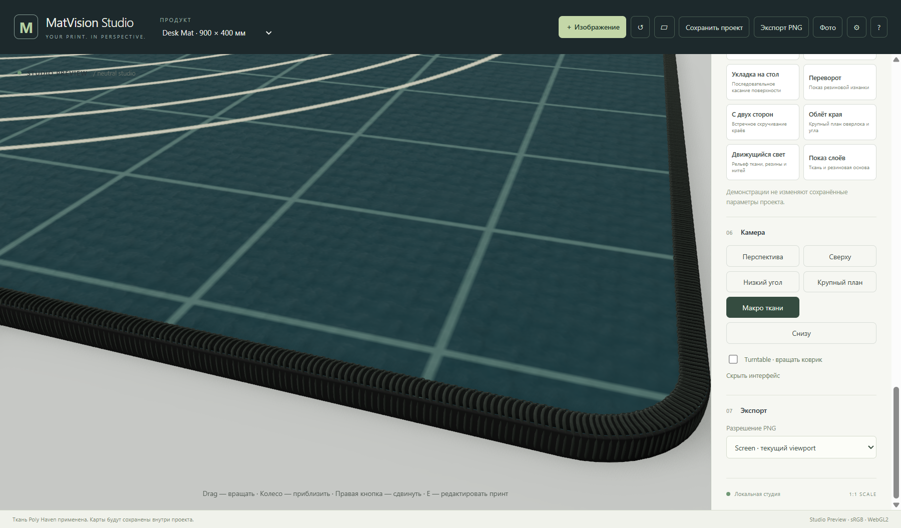
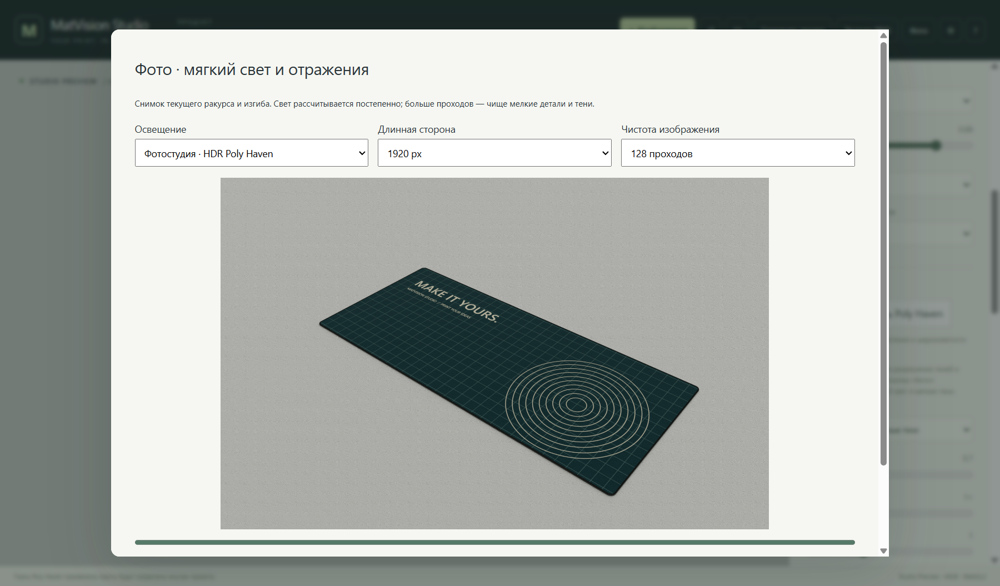
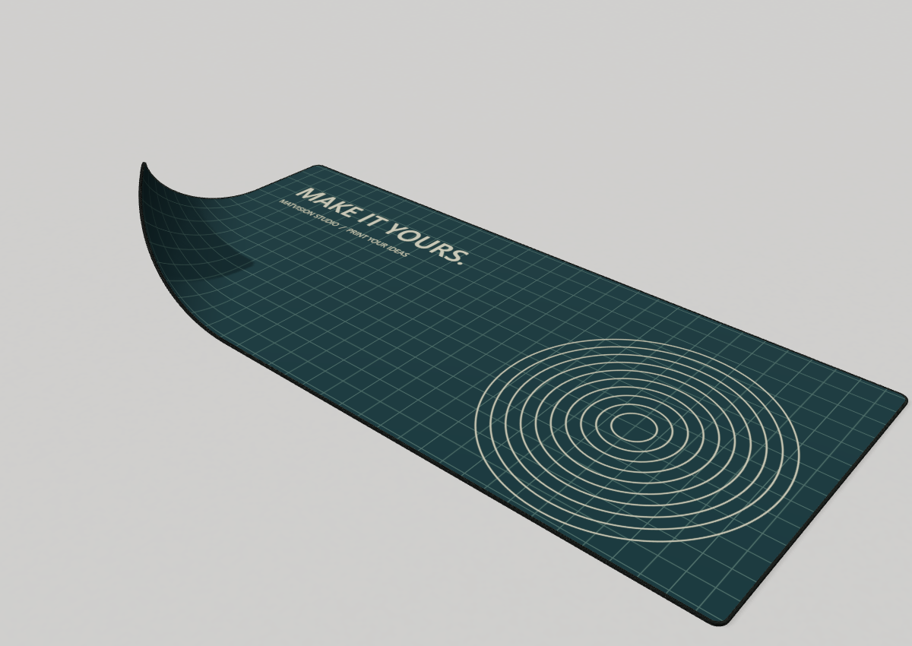
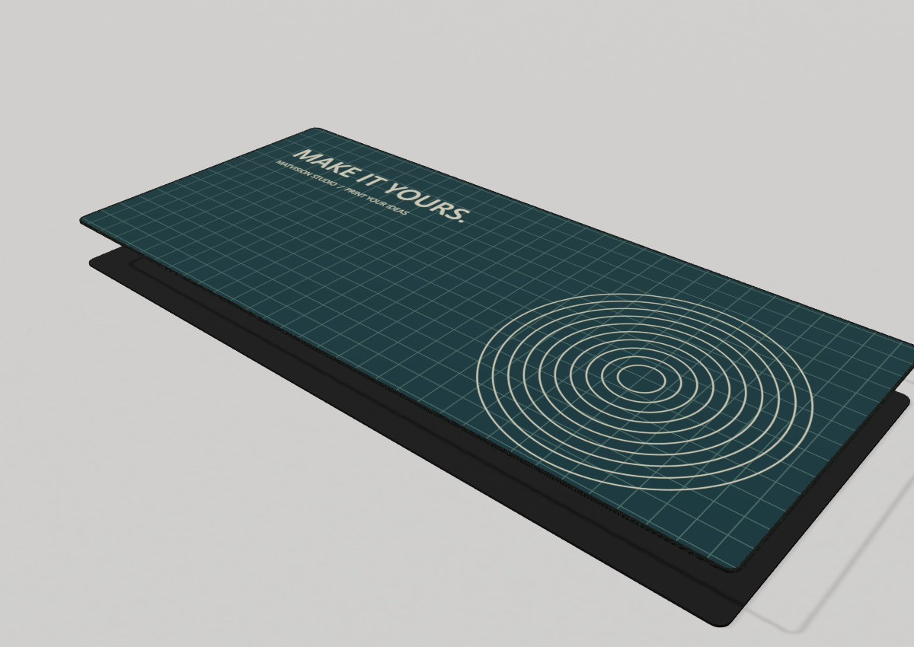
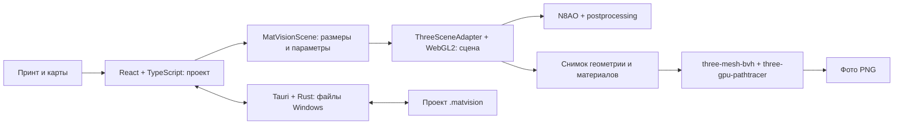

# MatVision Studio

**Ваш принт — на объёмном коврике, с тканью, швом и светом.**

Локальная Windows-студия для визуализации дизайнов ковриков: настройте рисунок в интерактивной 3D-сцене, рассмотрите материал и получите PNG с физическим освещением.

**Версия 0.1.6 · Windows x64 · Активная разработка · Приоритет: качество изображения**

[Скачать Windows-версию](https://github.com/AlexCodeHadjar/matvision-studio/releases/tag/v0.1.6) · [Инструкция](docs/USER_GUIDE.md) · [План развития](ROADMAP.md) · [Сравнение с аналогами](docs/COMPARISON.md) · [Сборка](DEVELOPMENT.md)



_Реальный экспорт установленной 0.1.5: Windows, RTX 3050 Laptop, 1920 × 1232 px, 128 проходов. Остаточный шум сохранён; кадр не ретушировался и не генерировался ИИ._

## Для чего нужен проект

MatVision Studio помогает дизайнерам, мастерским печати и продавцам показывать будущий внешний вид коврика до изготовления: оценивать композицию, демонстрировать край и изнанку, сравнивать материалы и готовить изображения для согласования с заказчиком.

Основная польза — предметный рабочий процесс: **загрузить принт → настроить изделие → выбрать ракурс → сохранить проект и изображение**. Не нужно самостоятельно собирать коврик, материалы и свет в универсальном 3D-редакторе. Экономия времени — ожидаемая польза, пока без сравнительного измерения.

Это визуальный прогноз. Точное совпадение с печатью требует измерений реальной ткани, чернил, принтера и профилей цвета.

## Уже работает

| Задача   | Возможности 0.1.6                                                                                        |
| -------- | -------------------------------------------------------------------------------------------------------- |
| Изделие  | Desk Mat 900 × 400 мм, Mouse Pad 400 × 450 мм, толщина, скругления, обычный/прошитый край                |
| Принт    | PNG/JPEG/WebP, drag-and-drop, Cover/Contain/Stretch, масштаб, сдвиг, поворот, effective DPI              |
| Материал | Ткань и резина; карты цвета/нормалей/шероховатости/высоты; физический масштаб повторения                 |
| Свет     | Студийные схемы, поверхности стола, контактные тени, локальная HDR-панорама Poly Haven для фото          |
| Камера   | Свободное вращение, готовые ракурсы, макро ткани, вид снизу, линейка                                     |
| Движение | Скручивание и восемь демонстраций: уголок, волна, укладка, переворот, два рулона, облёт края, свет, слои |
| Файлы    | Переносимый `.matvision` v2 с принтом и картами; обычный PNG до 3840 px по длинной стороне               |
| Фото     | Трассировка путей, до 10 отражений луча, 128/512/1024 прохода, 1920/2560/3840 px, остановка и отмена     |

Движения используют заданные деформации. Полноценная физика ткани ещё в плане.

В 0.1.6 появился Scene Core и переключатель **«Мягкий студийный свет»**: пять больших источников улучшают освещение ткани в интерактивной Studio. Режим экспериментальный, выключен по умолчанию и не сохраняется в проекте. В фоторежиме по-прежнему работает отдельная трассировка путей; новые источники в неё не передаются. [Архитектура и ограничения](docs/renderer-architecture.md).

## Как выглядит работа



_Интерактивный просмотр 0.1.5: ткань Poly Haven и отдельные петли оверлока._



_Фоторежим 0.1.5. Статус и кнопки доступны внутри прокручиваемого окна._

| Изгиб коврика                                 | Показ конструкции                                     |
| --------------------------------------------- | ----------------------------------------------------- |
|  |  |

_Последние два кадра — демонстрации 0.1.4, сохранённые в 0.1.5. Это показ геометрии, не физическое испытание. [Происхождение кадров](docs/images/README.md)._

## Быстрый старт

1. Откройте [релиз v0.1.6](https://github.com/AlexCodeHadjar/matvision-studio/releases/tag/v0.1.6), скачайте `MatVisionStudio-0.1.6-x64-setup.exe` и установите программу.
2. Нажмите **«＋ Изображение»** или перетащите PNG/JPEG/WebP на сцену.
3. Выберите изделие и размещение принта. Для готового материала нажмите **«Применить ткань Poly Haven»**.
4. Настройте край, свет и камеру. **«Макро ткани»** помогает рассмотреть рельеф и шов.
5. `Ctrl+S` сохраняет проект; `Ctrl+E` экспортирует обычный PNG.
6. **«Фото»** запускает физическую съёмку. По умолчанию 1920 px / 512 проходов; после расчёта сохраните PNG.

Подробности, горячие клавиши, импорт карт и устранение проблем: **[руководство пользователя](docs/USER_GUIDE.md)**.

Нужны Windows 10/11 x64, WebView2 и видеокарта с WebGL2. Установщик может скачать WebView2, если он отсутствует. После установки сцена и встроенные материалы работают локально; Node.js, Rust, Vite и облачная учётная запись пользователю не нужны. Пока репозиторий приватный, скачивание релиза требует доступа к нему.

## Как устроено



Размеры изделия и Scene Core выражены в миллиметрах; Three.js преобразует их в метры. Принт связан с поверхностью через UV-координаты и следует за изгибами. Расчёт света идёт в линейном пространстве, вывод — sRGB с ACES. Для фото создаётся отдельная сцена с запечённым принтом и полной геометрией петель шва. Rust обслуживает файлы и Windows-интеграцию, но не рассчитывает каждый кадр.

| Технология                        | Версия                        | Роль                                             |
| --------------------------------- | ----------------------------- | ------------------------------------------------ |
| Tauri / Rust / WebView2           | Tauri Rust 2.11.5, API 2.11.1 | Окно Windows, файлы, установщик                  |
| React / TypeScript                | 19.3.0 / 6.0.3                | Интерфейс, состояние и типы                      |
| Three.js / WebGL2                 | 0.186.0                       | Геометрия, камера, материалы и свет              |
| N8AO                              | 2.0.1                         | Контактное затенение                             |
| postprocessing                    | 6.39.5                        | SMAA, тональное преобразование, композиция       |
| three-gpu-pathtracer              | 0.0.24                        | Прогрессивный фоторендер                         |
| three-mesh-bvh                    | 0.9.5                         | Ускорение пересечений лучей; подготовка в worker |
| Vite / pnpm                       | 8.3.0 / 11.19.0               | Сборка и зависимости                             |
| Vitest / Playwright / WebdriverIO | см. package.json              | CPU-, браузерные и Windows-проверки              |
| Poly Haven                        | CC0-ресурсы                   | Локальные карты ткани и HDR-фотостудия           |

Перечисленные графические библиотеки действительно используются. Blender, Ammo.js, SSGI и Material Maker не встроены. [Сторонние лицензии](docs/THIRD_PARTY.md).

## Отличия и ограничения

Специализация на ковриках, локальные проекты с вложенными материалами и общий процесс для принта, шва, изгибов и фото — основа проекта. Онлайн-сервисы удобны готовыми сценами и разнообразием шаблонов; Blender предоставляет значительно более широкие средства моделирования и симуляции.

Мы не заявляем превосходство над всеми аналогами по скорости или реализму: сравнительного теста пока нет. [Сравнение с Pacdora, PSD-мокапами и Blender](docs/COMPARISON.md) содержит источники и границы применимости.

- На установленной Windows-версии подтверждены фото **1920 × 1232 / 128 проходов на RTX 3050 Laptop**, нативное сохранение PNG/проектов, отмена, повторное открытие и возврат в студию. [Отчёт](docs/release/native-quality-0.1.5.json).
- Фото 2560/3840 px и 512/1024 прохода доступны, но не сертифицированы этим тестом. Обычный 4K PNG проверялся отдельно.
- На протестированном Intel UHD / Direct3D11 фоторежим искажает материалы и блокируется с объяснением. Программа запрашивает мощную видеокарту; остальные GPU требуют проверки.
- На малом числе проходов виден шум; denoiser пока отсутствует. В экспериментальном Studio микроволокна представлены отдельной картой нормалей, но не геометрией и пока не перенесены в Photo. Карта высоты не меняет силуэт.
- `.matvision` v2 включает принт и карты; читаются старые v0/v1. Приложение 0.1.4 не открывает v2. Параметры отдельного фото пока не сохраняются в проекте.
- ICC Print Proof, видеоэкспорт и полноценная физика ткани ещё не реализованы.

## Разработка и план

```powershell
git clone https://github.com/AlexCodeHadjar/matvision-studio.git
cd matvision-studio
pnpm install --frozen-lockfile
pnpm typecheck
pnpm test
pnpm tauri dev
```

Для нативного запуска установите Rust/MSVC/Windows SDK и WebView2: **[подробная инструкция разработчика](DEVELOPMENT.md)**.

Ближайшие направления: качество фото и сохранение его параметров, ткань и край крупным планом, проверяемые изгибы и физика, каталог материалов, пакетная съёмка. **[ROADMAP.md](ROADMAP.md)** объясняет пользу, проверки и необходимые уточнения. Настройки слабых ПК отложены до приёмки качества.

## Документация

- [Пользовательская инструкция](docs/USER_GUIDE.md) · [План](ROADMAP.md) · [Аналоги](docs/COMPARISON.md)
- [Разработка](DEVELOPMENT.md) · [Тестирование](TESTING.md) · [Архитектура](ARCHITECTURE.md)
- [Аудит рендеринга](docs/renderer-architecture-audit.md) · [Scene Core и экспериментальный свет](docs/renderer-architecture.md)
- [Реализм](REALISM.md) · [Анимации](ANIMATIONS.md) · [Изменения](CHANGELOG.md)
- [Вклад в проект](CONTRIBUTING.md) · [Сторонние лицензии](docs/THIRD_PARTY.md)

Репозиторий содержит полный актуальный срез исходников 0.1.6, тесты, документацию и ресурсы. Установщик размещается в Releases; зависимости, кеши сборки и личные проекты в Git не включаются. [Нативная проверка 0.1.6](docs/release/native-quality-0.1.6.json) покрывает Studio, новый переключатель и завершение 128 проходов Photo. Исторические отчёты относятся к указанным версиям и не заменяют новую проверку. Отдельная лицензия собственного кода ещё не оформлена; лицензии зависимостей сохраняются.
