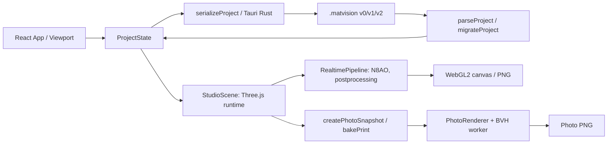

# Аудит архитектуры рендеринга · 23 сентября 2026

Срез: `main` 0.1.5, коммит `baae1b6`. Цель: добавить независимое описание сцены без замены Three.js, изменения `.matvision` v2 и потери Photo/PNG. Этот аудит составлен по коду перед реализацией этапов 2–3; фактическая граница после них описана в `renderer-architecture.md`.

## Поток данных

`ProjectState` в `App` — источник истины сохранённых параметров. `StudioScene` владеет Three-объектами, закодированный принт декодируется отдельно, `CameraRig` владеет текущей временной позой; перед сохранением `getCameraState()` переносит её в проект. `PhotoDialog` управляет временной задачей и отменой; фото копирует позу и материалы в отдельный снимок. Анимации временные и не меняют сохранённый проект.

## Инвентаризация и риски

| Подсистема     | Основные файлы/функции                                                                             | Откуда → куда                                               | Истина / повторное использование / риск                                                                              |
| -------------- | -------------------------------------------------------------------------------------------------- | ----------------------------------------------------------- | -------------------------------------------------------------------------------------------------------------------- |
| Сцена, цикл    | `src/scene/StudioScene.ts` `constructor`, `animate`, `dispose`                                     | `ProjectState` → WebGL2/Three                               | Three mesh/material/scene владеет runtime; цикл один, не создавать второй                                            |
| Камера         | `src/camera/CameraRig.ts` `restore`, `setPreset`, `getState`; `src/ui/App.tsx`                     | проект → OrbitControls → сохранение                         | Текущая камера в `CameraRig`; переходы и нижняя полусфера требуют сохранения                                         |
| Ткань          | `src/materials/fabric.ts`, `microtexture.ts`, `assets.ts`, `height.ts`, `profile.ts`               | проект/карты/принт → PhysicalMaterial                       | Runtime texture и shader extension не переносить в сериализуемую модель; normalY и UV независимы                     |
| Резина/шов     | `src/materials/rubber.ts`, `stitched.ts`; `src/geometry/stitch.ts`                                 | product/карты → нижняя сторона/петли                        | Петель много, Photo разворачивает instances; регрессии UV/владения ресурсами                                         |
| Окружение/цвет | `src/scene/environment.ts` `createStudioEnvironment`; `src/color/ColorPipeline.ts`                 | preset → HDR radiance → PMREM; texture → sRGB/ACES          | PMREM принадлежит Studio, создаётся заново при preset/quality, освобождается после замены; не делать второй tone map |
| Основной свет  | `StudioScene.applyEnvironmentSettings`, `fitShadowToProduct`                                       | preset → DirectionalLight/shadow/fog/floor                  | shadow cache зависит от движения; не менять legacy-блики без opt-in                                                  |
| Постобработка  | `src/scene/RealtimePipeline.ts`                                                                    | Three scene/camera → N8AO Ultra/ACES/SMAA                   | один pipeline для viewport/обычного PNG; отключение не должно оставлять targets                                      |
| Фото           | `src/photo/snapshot.ts`, `bake.ts`, `PhotoRenderer.ts`, `src/ui/PhotoDialog.tsx`                   | живой Three snapshot + проект → BVH worker/pathtracer → PNG | Фото пока зависит от Three runtime; обязательны cancel, cleanup, корректная RGBA-геометрия                           |
| Worker         | `GenerateMeshBVHWorker` в `PhotoRenderer.ts`                                                       | снимок mesh → BVH                                           | terminate/dispose при закрытии фото; отдельного worker у Studio нет                                                  |
| PNG            | `StudioScene.exportPng`, `PhotoRenderer.png`, `src/native/index.ts`, `src-tauri/src/commands.rs`   | canvas → Blob → native save                                 | размеры/цвет/восстановление viewport после ошибки; Photo и обычный PNG разные пути                                   |
| Формат         | `src/project/index.ts` `parseProject`, `migrateProject`, `serializeProject`                        | JSON → `ProjectState`                                       | v2 хранит base64 принт/карты; сохранять строго v2, v0/v1 мигрируют                                                   |
| Tauri          | `src-tauri/src/lib.rs`, `commands.rs`, `files.rs`                                                  | IPC → диалоги/атомарные файлы                               | локальные команды чтения/записи; механизма запуска Cycles/других процессов пока нет                                  |
| Print/layout   | `src/print-layout/material.ts`, `src/textures/import.ts`                                           | `PrintSource`/layout → декодированная текстура/UV           | исходные пиксели нужны для DPI; не подменять данными GPU-preview                                                     |
| Геометрия      | `src/products/index.ts`, `src/geometry/mat.ts`, `roll.ts`, `stitch.ts`; `StudioScene.rebuildMat`   | каталог мм + состояние → mesh в метрах                      | размер/толщина/скругление, bend и шов должны оставаться согласованы                                                  |
| UI/качество    | `src/ui/App.tsx`, `Viewport.tsx`, `RealismControls.tsx`, `PhotoDialog.tsx`; `src/scene/quality.ts` | настройки → Studio/Photo                                    | смена качества меняет PMREM/тени; Photo не должен зависеть от нового realtime-переключателя                          |
| Проверки       | `src/**/*.test.ts`, `tests/browser`, `tests/native`, `.github/workflows/quality.yml`               | функции/браузер/Windows → отчёты                            | CPU и CI не заменяют визуальную проверку GPU; старые golden scenes не обновлять без review                           |

## Единицы и договорённости

Каталог изделия, printable area, толщина и шаг повторения материала — **мм**. Three-геометрия и положение света/камеры в runtime — **м**. X — ширина, Y — вертикаль, Z — глубина; печатная правая сторона направлена к +X, верх изображения — к −Z. Layout offsets — доли ширины/высоты области печати, rotation — градусы против часовой стрелки сверху. Поле камеры `fovDeg` — градусы, её позиции в `ProjectState` уже выражены метрами; нельзя переинтерпретировать их как мм при миграции.

Цветные карты — sRGB, normal/roughness/height — data textures. Свет и HDR radiance — scene-linear. `keyIntensity` и environmentIntensity — существующие безразмерные настройки/семантика Three; физическая эквивалентность мощности между backend'ами **не установлена**. `normalY` явно различает OpenGL/DirectX. Import карты имеет `tileMm`, `PrintLayout` задаёт отдельный от ткани трансформ принта.

## Совместимость проектов

`migrateProject` принимает v0, v1 и v2; для v0 он заполняет legacy defaults, а v1/v2 проходят строгую валидацию. `serializeProject` всегда пишет v2. Старая 0.1.4 не открывает v2. Служебные `MatVisionScene`, area-light rig и профиль GPU **не нужно сериализовать**: они могут выводиться из `ProjectState` и текущих пресетов без изменения документа. Если в будущем пользователь будет сохранять собственный rig или HDR, потребуется новое поле, его валидация, миграция и решение о версии формата. Исходные `.matvision` файлы этим этапом не изменяются.

## Границы и последовательность

1. Renderer-independent **Scene Core** как производная `ProjectState`: product, print metadata/layout, material references, environment, floor, camera и базовый свет. Не копировать base64 и не помещать Three objects. Инварианты единиц и legacy round-trip проверять CPU-тестами.
2. `ThreeSceneAdapter` принимает Core и синхронизирует законченный вертикальный срез (базовый свет, фон, пол) с текущим `StudioScene`. Остальные geometry/material/Photo пока читают legacy state. Один цикл `StudioScene.animate` и один pipeline сохраняются.
3. Studio lighting: сначала baseline и узкий opt-in `RectAreaLight` rig; затем сравнение картин на одинаковой сцене, проверка WebView2/GPU, сохранение обратимого fallback. PMREM, N8AO и ACES остаются в прежнем пути.
4. Отдельно переносить camera, geometry, maps в Core/adapters после визуальных проверок каждого среза. Затем прототипировать независимую передачу сцены для будущего локального Cycles backend. Сейчас Cycles отсутствует.

Зависимости проверок: typecheck/lint → CPU conversions/v0–v2 → browser Studio/PNG/Photo → native WebView2/photo. Без нативного кадра нельзя утверждать равенство внешнего вида или стабильность любого нового GPU-эффекта.
